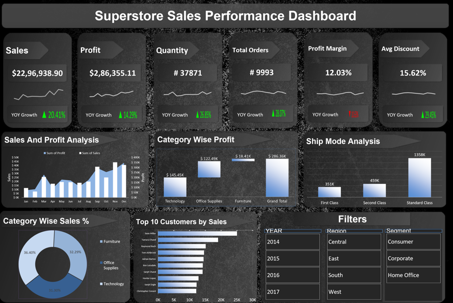

# 📊 Superstore Sales Performance Dashboard

## 📌 Project Overview

This project presents an interactive **Sales Performance Dashboard** built in Microsoft Excel using the Superstore dataset. The dashboard provides comprehensive insights into business performance by analyzing sales, profit, customer behavior, product categories, and shipping patterns.

The objective of this project is to transform raw sales data into actionable business insights through data cleaning, KPI development, pivot table analysis, and interactive dashboarding.

---

## 🎯 Business Problem

Organizations generate large volumes of transactional data every day. However, without proper analysis, it becomes difficult to identify sales trends, profitable product categories, customer behavior, and operational inefficiencies.

This dashboard helps business stakeholders answer key questions such as:

* Which regions generate the highest sales?
* Which product categories contribute the most profit?
* Who are the top-performing customers?
* How do discounts impact profitability?
* Which shipping modes are most frequently used?

---

## 🛠️ Tools & Techniques Used

* Microsoft Excel
* Data Cleaning
* Pivot Tables
* Pivot Charts
* KPI Cards
* Slicers
* Conditional Formatting
* Dashboard Design

---

## 📂 Dataset Information

The dataset contains historical sales transactions including:

* Order Details
* Customer Information
* Product Information
* Sales and Profit Metrics
* Discount Details
* Shipping Information
* Regional Data

---

## 📈 Key Performance Indicators (KPIs)

The dashboard tracks the following KPIs:

* Total Sales
* Total Profit
* Total Orders
* Total Quantity Sold
* Profit Margin (%)
* Average Discount (%)

---

## 📊 Dashboard Features

### Sales & Profit Analysis

Analyzes sales and profit trends over time.

### Category-wise Profit Analysis

Identifies the most profitable product categories.

### Ship Mode Analysis

Evaluates sales contribution by shipping mode.

### Category-wise Sales Distribution

Visualizes category contribution to total sales.

### Top Customers Analysis

Highlights top customers contributing to revenue.

### Interactive Filters

Users can dynamically filter dashboard results using:

* Year
* Region
* Segment

---

## 🔍 Business Insights

* Technology category generated the highest profit.
* Standard Class shipping mode contributed the highest sales.
* A small group of customers accounted for a significant portion of total revenue.
* Discount levels have a direct impact on profit margins.
* Sales performance varied significantly across regions.

---

## 🚀 Project Workflow

1. Data Collection
2. Data Cleaning and Preparation
3. Feature Engineering
4. KPI Creation
5. Pivot Table Development
6. Chart Creation
7. Dashboard Design
8. Insight Generation

---

## 📷 Dashboard Preview

---

---

